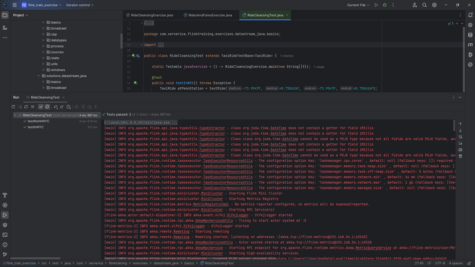
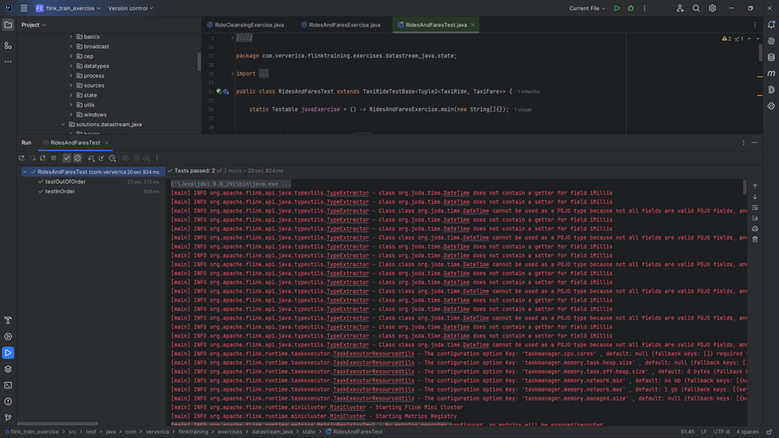
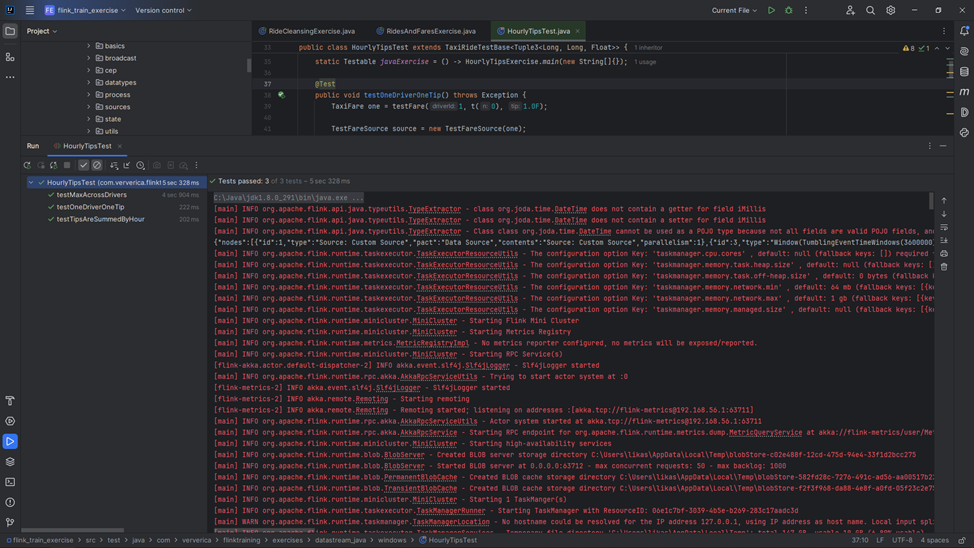
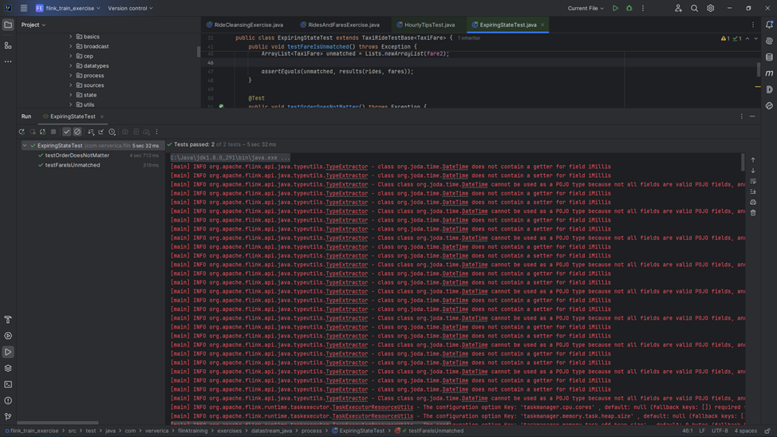

# Задание
Выполнить следующие задания из набора заданий репозитория https://github.com/ververica/flink-training-exercises:

- RideCleanisingExercise
- RidesAndFaresExercise
- HourlyTipsExerxise
- ExpiringStateExercise

### RideCleanising
sem8_bigdata_lab3/src/main/java/com/ververica/flinktraining/exercises/datastream_java/basics/RideCleansingExercise.java
```java
public class RideCleansingExercise extends ExerciseBase {
	public static void main(String[] args) throws Exception {

		ParameterTool params = ParameterTool.fromArgs(args);
		final String input = params.get("input", ExerciseBase.pathToRideData);

		final int maxEventDelay = 60;       // events are out of order by max 60 seconds
		final int servingSpeedFactor = 600; // events of 10 minutes are served in 1 second

		// set up streaming execution environment
		StreamExecutionEnvironment env = StreamExecutionEnvironment.getExecutionEnvironment();
		env.setParallelism(ExerciseBase.parallelism);

		// start the data generator
		DataStream<TaxiRide> rides = env.addSource(rideSourceOrTest(new TaxiRideSource(input, maxEventDelay, servingSpeedFactor)));

		DataStream<TaxiRide> filteredRides = rides
				// filter out rides that do not start or stop in NYC
				.filter(new NYCFilter());

		// print the filtered stream
		printOrTest(filteredRides);

		// run the cleansing pipeline
		env.execute("Taxi Ride Cleansing");
	}

	private static class NYCFilter implements FilterFunction<TaxiRide> {

		@Override
		public boolean filter(TaxiRide taxiRide) throws Exception {
			return GeoUtils.isInNYC(taxiRide.startLon, taxiRide.startLat)
					&& GeoUtils.isInNYC(taxiRide.endLon, taxiRide.endLat);
		}
	}

}
```



### RidesAndFares
sem8_bigdata_lab3/src/main/java/com/ververica/flinktraining/exercises/datastream_java/state/RidesAndFaresExercise.java
```java
public class RidesAndFaresExercise extends ExerciseBase {
	public static void main(String[] args) throws Exception {

		ParameterTool params = ParameterTool.fromArgs(args);
		final String ridesFile = params.get("rides", pathToRideData);
		final String faresFile = params.get("fares", pathToFareData);

		final int delay = 60;					// at most 60 seconds of delay
		final int servingSpeedFactor = 1800; 	// 30 minutes worth of events are served every second

		// set up streaming execution environment
		StreamExecutionEnvironment env = StreamExecutionEnvironment.getExecutionEnvironment();
		env.setParallelism(ExerciseBase.parallelism);

		DataStream<TaxiRide> rides = env
				.addSource(rideSourceOrTest(new TaxiRideSource(ridesFile, delay, servingSpeedFactor)))
				.filter((TaxiRide ride) -> ride.isStart)
				.keyBy("rideId");

		DataStream<TaxiFare> fares = env
				.addSource(fareSourceOrTest(new TaxiFareSource(faresFile, delay, servingSpeedFactor)))
				.keyBy("rideId");

		DataStream<Tuple2<TaxiRide, TaxiFare>> enrichedRides = rides
				.connect(fares)
				.flatMap(new EnrichmentFunction());

		printOrTest(enrichedRides);

		env.execute("Join Rides with Fares (java RichCoFlatMap)");
	}

	public static class EnrichmentFunction extends RichCoFlatMapFunction<TaxiRide, TaxiFare, Tuple2<TaxiRide, TaxiFare>> {

		@Override
		public void open(Configuration config) throws Exception {
			throw new MissingSolutionException();
		}

		@Override
		public void flatMap1(TaxiRide ride, Collector<Tuple2<TaxiRide, TaxiFare>> out) throws Exception {
		}

		@Override
		public void flatMap2(TaxiFare fare, Collector<Tuple2<TaxiRide, TaxiFare>> out) throws Exception {
		}
	}
}
```



### HourlyTips

```java
public class HourlyTipsExercise extends ExerciseBase {

	public static void main(String[] args) throws Exception {

		// read parameters
		ParameterTool params = ParameterTool.fromArgs(args);
		final String input = params.get("input", ExerciseBase.pathToFareData);

		final int maxEventDelay = 60;       // events are out of order by max 60 seconds
		final int servingSpeedFactor = 600; // events of 10 minutes are served in 1 second

		// set up streaming execution environment
		StreamExecutionEnvironment env = StreamExecutionEnvironment.getExecutionEnvironment();
		env.setStreamTimeCharacteristic(TimeCharacteristic.EventTime);
		env.setParallelism(ExerciseBase.parallelism);

		// start the data generator
		DataStream<TaxiFare> fares = env.addSource(fareSourceOrTest(new TaxiFareSource(input, maxEventDelay, servingSpeedFactor)));

		throw new MissingSolutionException();
	}

}
```



### ExpiringState
```java
public class ExpiringStateExercise extends ExerciseBase {
	static final OutputTag<TaxiRide> unmatchedRides = new OutputTag<TaxiRide>("unmatchedRides") {};
	static final OutputTag<TaxiFare> unmatchedFares = new OutputTag<TaxiFare>("unmatchedFares") {};

	public static void main(String[] args) throws Exception {

		ParameterTool params = ParameterTool.fromArgs(args);
		final String ridesFile = params.get("rides", ExerciseBase.pathToRideData);
		final String faresFile = params.get("fares", ExerciseBase.pathToFareData);

		final int maxEventDelay = 60;           // events are out of order by max 60 seconds
		final int servingSpeedFactor = 600; 	// 10 minutes worth of events are served every second

		// set up streaming execution environment
		StreamExecutionEnvironment env = StreamExecutionEnvironment.getExecutionEnvironment();
		env.setStreamTimeCharacteristic(TimeCharacteristic.EventTime);
		env.setParallelism(ExerciseBase.parallelism);

		DataStream<TaxiRide> rides = env
				.addSource(rideSourceOrTest(new TaxiRideSource(ridesFile, maxEventDelay, servingSpeedFactor)))
				.filter((TaxiRide ride) -> (ride.isStart && (ride.rideId % 1000 != 0)))
				.keyBy(ride -> ride.rideId);

		DataStream<TaxiFare> fares = env
				.addSource(fareSourceOrTest(new TaxiFareSource(faresFile, maxEventDelay, servingSpeedFactor)))
				.keyBy(fare -> fare.rideId);

		SingleOutputStreamOperator processed = rides
				.connect(fares)
				.process(new EnrichmentFunction());

		printOrTest(processed.getSideOutput(unmatchedFares));

		env.execute("ExpiringStateExercise (java)");
	}

	public static class EnrichmentFunction extends KeyedCoProcessFunction<Long, TaxiRide, TaxiFare, Tuple2<TaxiRide, TaxiFare>> {

		@Override
		public void open(Configuration config) throws Exception {
			throw new MissingSolutionException();
		}

		@Override
		public void onTimer(long timestamp, OnTimerContext ctx, Collector<Tuple2<TaxiRide, TaxiFare>> out) throws Exception {
		}

		@Override
		public void processElement1(TaxiRide ride, Context context, Collector<Tuple2<TaxiRide, TaxiFare>> out) throws Exception {
		}

		@Override
		public void processElement2(TaxiFare fare, Context context, Collector<Tuple2<TaxiRide, TaxiFare>> out) throws Exception {
		}
	}
}
```



